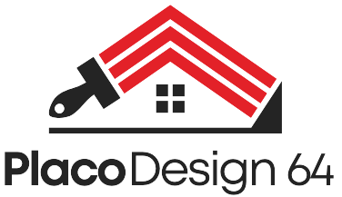

# Placo Design 64



Ce dépôt contient le code source du site vitrine et de l'interface d'administration pour **Placo Design 64**, une entreprise spécialisée dans les travaux de rénovation (plâtrerie, peinture, carrelage) au Pays Basque.

Le site a été conçu pour être à la fois performant, sécurisé et facile à administrer pour le client.

## ✨ Fonctionnalités

- **Interface publique :**
    - Présentation des différents services de l'entreprise.
    - Galerie des réalisations avec un mode plein écran (lightbox) interactif.
    - Formulaire de contact sécurisé avec validation (reCAPTCHA).
    - Design entièrement responsive, adapté aux mobiles et tablettes.

- **Panneau d'administration :**
    - Système d'authentification sécurisé avec JWT.
    - Gestion complète des réalisations : ajout, modification et suppression.
    - Upload d'images directement sur le cloud (Cloudinary).
    - Possibilité de choisir quelles réalisations mettre en avant sur la page d'accueil.

## 🛠️ Technologies utilisées

- **Backend :**
    - **Node.js** avec **Express** pour le serveur API REST.
    - **MongoDB** avec **Mongoose** comme base de données.
    - **JWT** pour la gestion de l'authentification.
    - **Cloudinary** pour le stockage et la gestion des images.
    - **Nodemailer** pour l'envoi des e-mails depuis le formulaire de contact.

- **Frontend :**
    - **React** (avec Vite) pour une interface utilisateur réactive.
    - **React Router** pour la navigation entre les pages.
    - **Sass (SCSS)** pour un stylisme avancé et modulaire.
    - **Axios** pour les requêtes vers l'API backend.

## 🚀 Démarrage rapide

Suivez ces étapes pour lancer le projet sur votre machine locale.

### Prérequis

- Node.js (version 18.x ou supérieure)
- npm
- Une base de données MongoDB (vous pouvez en créer une gratuitement sur [MongoDB Atlas](https://www.mongodb.com/cloud/atlas))

### Installation

1.  **Clonez le projet :**
    ```bash
    git clone https://github.com/votre-utilisateur/placo-design-64.git
    cd placo-design-64
    ```

2.  **Installez les dépendances du backend :**
    ```bash
    npm install
    ```

3.  **Installez les dépendances du frontend :**
    ```bash
    cd client
    npm install
    cd .. 
    ```

4.  **Configurez les variables d'environnement :**
    Créez un fichier `.env` à la racine du projet et remplissez-le en vous basant sur cet exemple :

    ```env
    # Fichier .env (à la racine)

    # Base de données
    MONGODB_URI="votre_uri_mongodb"

    # Authentification
    JWT_SECRET="votre_cle_secrete_tres_longue_et_aleatoire"

    # E-mail de contact (pour Nodemailer)
    CONTACT_EMAIL="votre_email@gmail.com"
    CONTACT_EMAIL_PASSWORD="votre_mot_de_passe_application_google" # Important: utilisez un mot de passe d'application

    # Cloudinary (stockage d'images)
    CLOUDINARY_CLOUD_NAME="nom_de_votre_cloud"
    CLOUDINARY_API_KEY="votre_api_key"
    CLOUDINARY_API_SECRET="votre_api_secret"
    ```

### Lancement

Vous pouvez lancer le serveur et le client dans deux terminaux séparés :

- **Pour le backend :**
    ```bash
    npm run server
    ```
    Le serveur sera accessible sur `http://localhost:3001`.

- **Pour le frontend :**
    ```bash
    cd client
    npm run dev
    ```
    Le site sera visible sur `http://localhost:5173`.

## ⚙️ Administration

Pour vous connecter au panneau d'administration en local, rendez-vous sur `/login` et utilisez les identifiants créés dans votre base de données.

---

N'hésitez pas à me contacter si vous avez des questions !
